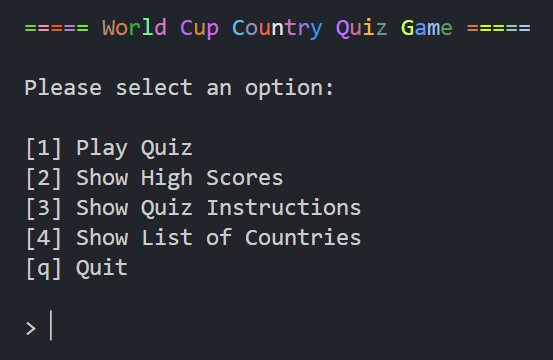
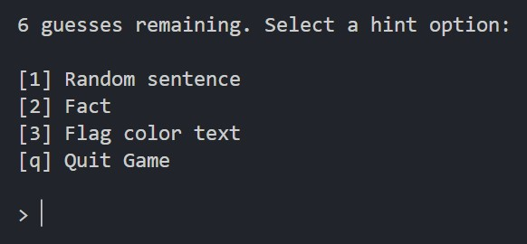
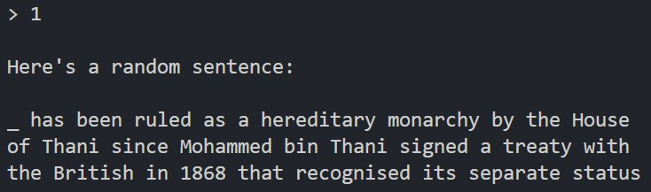
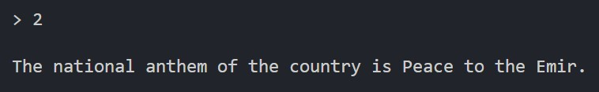
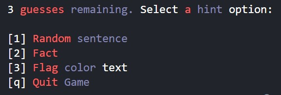
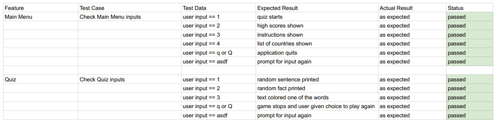

# Countries Scraper Game

A terminal quiz game written in Python which challenges the player to guess a country in 6 tries or less based on various types of hints scraped from the country's Wikipedia page and/or flag colors scraped from [FlagColorCodes.com](https://www.flagcolorcodes.com/).

High scores are recorded to a CSV file and can displayed in a pretty-printed table.

[Click to view project GitHub repository](https://github.com/quentin-mckay/countries-scraper-game)

The code follows the styling conventions outlined in [PEP 8](https://peps.python.org/pep-0008/)

## Installation and Usage

1. Run `chmod +ux run_app.sh` to make the bash script executable

2. Run `./run_app.sh` to launch the application

Two command line options are available:
1. `--show-country` will display the correct answer at the beginning of each game. Useful for testing and debugging.

2. `--no-intro` will skip the intro animation. Useful wehn testing the application so you don't have to sit through the unnecessary (albeit short) animation.

Example usage with both flags: `./run_app --show-country --no-intro`

Note: The application uses the `match case` statement and will exit if run with any version of Python less than 3.10.

## Features

### Main Menu

The main menu provides multiple options with varying functionality and gives the user the option to quit.

### Hint Menu

The quiz game provides a hint system which lets the user pick a hint each turn before they guess the country.

### Hint - Wikipedia Random Sentence

A random sentence is scraped from the first 2 paragraphs of the country's wikipedia page.

### Hint - Wikipedia Facts

A fact scraped from Wikipedia is given following a pre-defined order (anthem -> president -> currency -> capital)

### Flag Color Text

Each time "[3] Flag Color Text" is selected as a hint option, the words in the remaing hints are colored an additional color of the country's flag using the package [Colr](https://pypi.org/project/Colr/).  

### High Scores CSV File

Each time the user guesses correctly, their attempt is written to a csv file of "High Scores". Three pieces of data are written (number of guesses attempted, overall time taken (seconds) to complete the game, and the correctly guessed country)

The user can also display the high scores by selecting the option from the main menu. The csv file is read, sorted by number of guesses, and pretty-printed using the [Tabulate](https://pypi.org/project/tabulate/) library for better readability.

### Flag Color Web-Scraping to JSON

A separate script was written to scrape the flag color hex codes for all 32 countries from [FlagColorCodes.com](https://www.flagcolorcodes.com/). 

The data was written into a JSON file and then read by the main application.

## Implementation Plan

The implementation plan was carried out using Trello.

[Click to view the Trello Board](https://trello.com/b/vWXNzHCk/countries-scraping-game)

## Testing Procedure

I used a combination of automated testing (using pytest) and manual testing. 

As most of the application flow is based on user input, the pytests test are unit tests on isolated functionality. 

1. Testing `get_flag_colors()` return the correct hex codes
2. Testing `filter_country_name()` correctly replaces the country name in the input string
3. Testing `scrape_country_info()` correctly returns a dictionary with correct length and values for given keys.

Also included in the /docs is a pdf of the manual tests.

